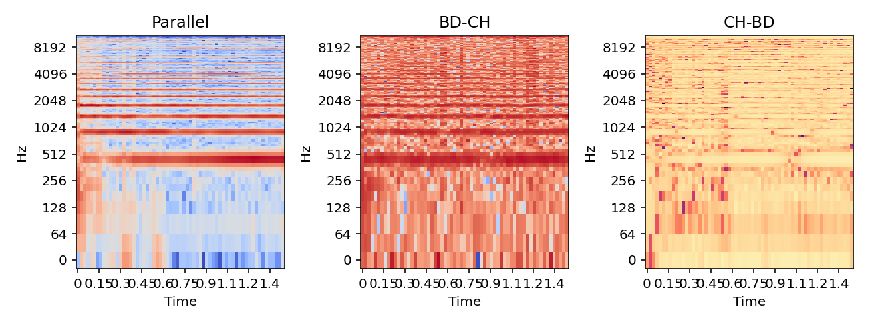
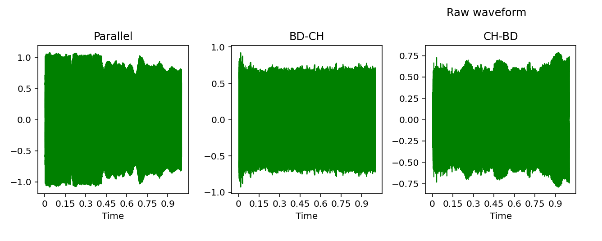

# VAE GUITAR

From all the possible notes of an electric guitar processed by ten different effects and different configurations, we employed a Variational Autoencoder to generate audio from the resultant latent space and compare them with a similar analog fx chain. The intention of the present research is to sum up to the outgoing interest to explore the relationships between deep learning models and timbrical variations. The main goal of this research is to propose another perspective of linking analog guitar effects for timbre generation outside the active emulation/recognition studies.

### FXs

1. TubeScreamer
2. BluesDriver
3. RAT
4. Chorus
5. Phaser
6. Flanger
7. Tape Echo
8. Sweep Echo
9. Digital Delay
10. Hall Reverb
11. Plate Reverb
12. Spring Reverb

### DATASET

    

        <audio controls style="width: 20%; padding: 0.5%">
            <source src="folder/TubeScreamer_6-0.wav">
        </audio>
        
        <audio controls style="width: 20%; padding: 0.5%">
            <source src="folder/folder/BluesDriver_6-0.wav">
        </audio> 
        <audio controls style="width: 20%; padding: 0.5%">
            <source src="folder/RAT_6-0.wav">
        </audio>
        <audio controls style="width: 20%; padding: 0.5%">
            <source src="folder/folder/Chorus_6-0.wav">
        </audio>
        <audio controls style="width: 20%; padding: 0.5%">
            <source src="folder/folder/Phaser_6-0.wav>
        </audio>
        <audio controls style="width: 20%; padding: 0.5%">
            <source src="folder/Flanger_6-0.wav">
        </audio>
        <audio controls style="width: 20%; padding: 0.5%">
            <source src="folder/Tape_echo6-0.wav">
        </audio>
        <audio controls style="width: 20%; padding: 0.5%">
            <source src="folder/SweepEcho_6-0.wav">
        </audio>
        <audio controls style="width: 20%; padding: 0.5%">
            <source src="folder/DigitalDlay6-0.wav">
        </audio>
        <audio controls style="width: 20%; padding: 0.5%">
            <source src="folder/Hall_Reverb6-0.wav">
        </audio>
        <audio controls style="width: 20%; padding: 0.5%">
            <source src="folder/Plate_Reverb6-0.wav">
        </audio>
        <audio controls style="width: 20%; padding: 0.5%">
            <source src="folder/Spring_Reverb_6-0.wav">
        </audio>

### Reconstruction

    

        <audio controls style="width: 20%; padding: 0.5%">
            <source src="folder/rec_DigitalDlay.wav">
        </audio>
        
        <audio controls style="width: 20%; padding: 0.5%">
            <source src="folder/rec_bluesdriver.wav">
        </audio> 
        <audio controls style="width: 20%; padding: 0.5%">
            <source src="folder/rec_chorus.wav">
        </audio>
        <audio controls style="width: 20%; padding: 0.5%">
            <source src="folder/rec_clean.wav">
        </audio>
        <audio controls style="width: 20%; padding: 0.5%">
            <source src="folder/rec_flanger.wav">
        </audio>
        <audio controls style="width: 20%; padding: 0.5%">
            <source src="folder/rec_phaser.wav">
        </audio>
        <audio controls style="width: 20%; padding: 0.5%">
            <source src="folder/rec_rat.wav">
        </audio>
        <audio controls style="width: 20%; padding: 0.5%">
            <source src="folder/rec_sweetEcho.wav">
        </audio>
        <audio controls style="width: 20%; padding: 0.5%">
            <source src="folder/rec_tapeEcho.wav">
        </audio>
        <audio controls style="width: 20%; padding: 0.5%">
            <source src="folder/rec_tubescreamer.wav">
        </audio>

### Latent Space

### Latent Space Interpolations

    

        <audio controls style="width: 20%; padding: 0.5%">
            <source src="folder/inter_1.wav">
        </audio>
        
        <audio controls style="width: 20%; padding: 0.5%">
            <source src="folder/inter_2.wav">
        </audio>
        <audio controls style="width: 20%; padding: 0.5%">
            <source src="folder/inter_3.wav">
        </audio>
        <audio controls style="width: 20%; padding: 0.5%">
            <source src="folder/inter_4.wav">
        </audio>
        <audio controls style="width: 20%; padding: 0.5%">
            <source src="folder/inter_5.wav">
        </audio>
        <audio controls style="width: 20%; padding: 0.5%">
            <source src="folder/inter_6.wav">
        </audio>
        <audio controls style="width: 20%; padding: 0.5%">
            <source src="folder/inter_7.wav">
        </audio>
        <audio controls style="width: 20%; padding: 0.5%">
            <source src="folder/inter_8.wav">
        </audio>
        <audio controls style="width: 20%; padding: 0.5%">
            <source src="folder/inter_9.wav">
        </audio>
        <audio controls style="width: 20%; padding: 0.5%">
            <source src="folder/inter_10.wav">
        </audio>

### Resultados

    

<audio controls style="width: 30%; padding: 0.5%">
            <source src="folder/inter_8.wav">
        </audio>
        <audio controls style="width: 30%; padding: 0.5%">
            <source src="folder/inter_9.wav">
        </audio>

    

        <audio controls style="width: 25%; padding: 0.5%">
            <source src="folder/1-0ChorusBluesParallel.wav">
        </audio>
        <audio controls style="width: 25%; padding: 0.5%">
            <source src="folder/BD-CH.wav">
        </audio>
        <audio controls style="width: 25%; padding: 0.5%">
            <source src="folder/CH-BD.wav">
        </audio>
        
        

